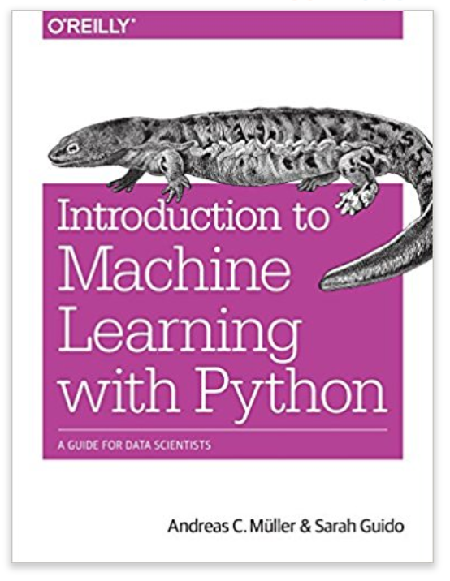

# Introduction to Machine Learning with Python

**Original Authors:** Andreas C. Mueller & Sarah Guido

This repository contains the reproduced code, exercises, and notes based on the O'Reilly book *"Introduction to Machine Learning with Python"*. The primary goal of this project is to provide a working, up-to-date environment to run the examples provided in the book, addressing common compatibility issues with modern Python libraries.

## 📋 Table of Contents

- [Prerequisites](#-prerequisites)
- [Installation Guide](#-installation-guide)
  - [Option A: Conda (Recommended)](#option-a-conda-recommended)
  - [Option B: Python Virtual Environment](#option-b-python-virtual-environment)
- [Project Structure](#-project-structure)
- [Usage](#-usage)
- [Troubleshooting & Common Issues](#-troubleshooting--common-issues)
- [Dependencies](#-dependencies)
- [Acknowledgments](#-acknowledgments)

## 📋 Prerequisites

To ensure a smooth setup, please ensure you have the following installed on your system:

* **Python 3.9+**: While the book was written for earlier versions, this repo is tested on Python 3.9+.
* **Anaconda or Miniconda**: Highly recommended for data science environment management.
* **Git**: For version control.
* **Graphviz**: Required for visualizing decision trees (see Troubleshooting section).

